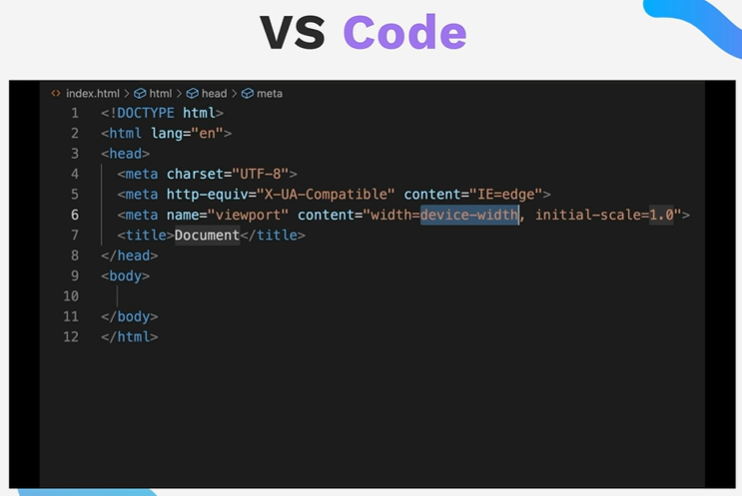

## Notes about HTML Boilerplate

1. <!DOCTTYPE html> tells the browser that we are using HTML version 5.
2. <html lang="en"> tells the browser that the language of the document is English.
3. What comes in the <head> element does not appear on the page, but it is important for the browser to understand the document.
4. <meta charset="UTF-8"> tells the browser that the character set is UTF-8.
5. <meta name="viewport" content="width=device-width, initial-scale=1.0"> tells the browser that the width of the viewport is the same as the width of the device and the initial zoom level is 1.0.
6. <title>HTML Boilerplate</title> is the title of the document that appears in the browser tab.